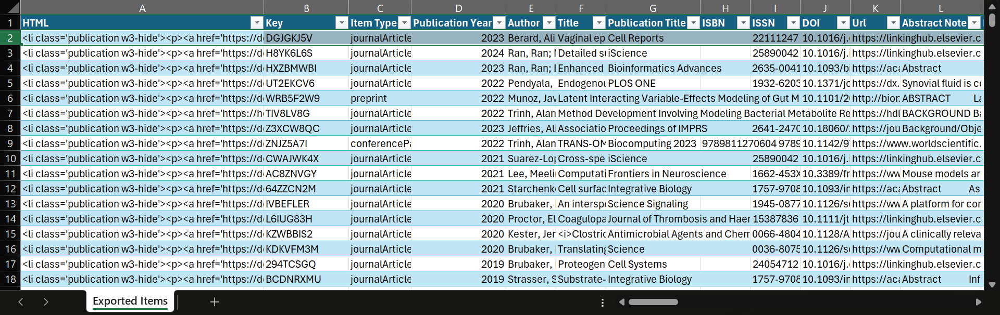

# Brubaker-Lab.github.io

## Directory

- `index.html` - The site itself
- `css/` - Custom CSS files
    - `colors.css` - Theme colors
    - `main.css` - Overrides for w3pro.css
    - `w3pro.css` - [W3.CSS Pro, as downloaded in October 2024](https://www.w3schools.com/w3css/4/w3pro.css)
- `img/` - Graphic assets.
    - `favicon.png` - 32px by 32px.
    - `group/` - Group photos. 1080px on the longest side, 144ppi, `.jpg` files.
    - `portraits/` - Individual photos. 1080px by 1080px, 144ppi, `.jpg` files.
    - `README/` - Images for `~/README.md`.
- `js/` - Custom javascript files.
    - `show.js` - Function for revealing hidden children (ie mobile navigation)
    - `publications.js` - Scripts to handle pagination of publications.

## Preparing Publications

### Current Solution

1. Update Zotero collection.
2. Export the Zotero collection as a `.csv`.
3. Open the exported file in Excel.
4. Create a new column in the first position with "HTML" as the column title.
5. Select all the data on the sheet (including the column created above) and press `CTRL+t` to convert it to a table.
1. Sort the data by the "Publication Year" 
6. In the "HTML" column you created, add the following formula to each cell:

```
=
"<li class='publication w3-hide'><p><a href='"
& IF(NOT(ISBLANK([@DOI])),"https://doi.org/" & [@DOI], [@Url])
& "'>"
& [@Title]
& "</a>, "
& [@Author]
& ", <i>"
& [@[Publication Title]]
& "</i>, "
& [@[Publication Year]]
& "</p></li>"
```

7. If done properly, the "HTML" column should contain cells of formatted HTML elements for each publication, looking something like this:



8. Delete all the current publications in `index.html`. There are comments in the file indicating where they begin and end.
9. Copy and paste the "HTML" column data from the spreadsheet into `index.html` where indicated by the comments.
10. Save and publish.

### Possible Solution

- Export HTML directly from Zotero with "Create Bibliography From Collection" with "American Medical Association 11th edition" formatting, then transclude it into `index.html` when the page loads.

## References

- Publications
    - Pagination
        - https://www.geeksforgeeks.org/create-a-pagination-using-html-css-and-javascript/
        - https://www.w3schools.com/w3css/w3css_examples.asp#:~:text=Examples%20explained-,W3.CSS%20Pagination,-Basic%20pagination
    - Transclusion
        - https://stackoverflow.com/questions/15583024/how-to-transclude-html-elements-in-a-document
- 
